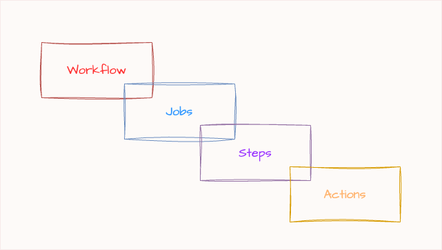
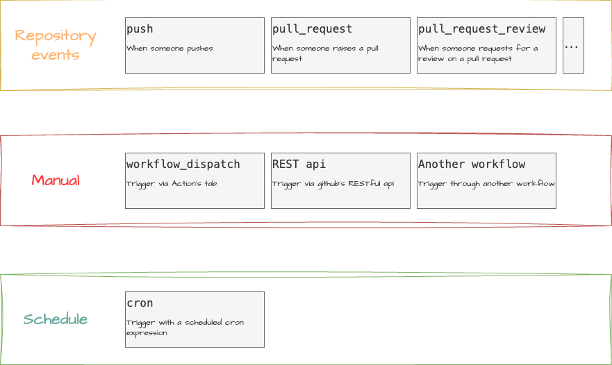
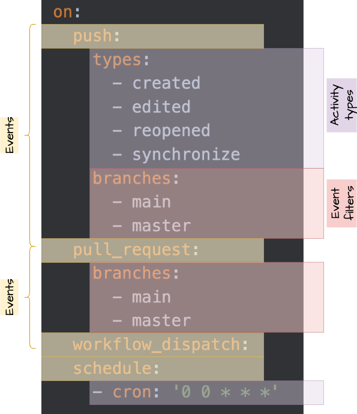
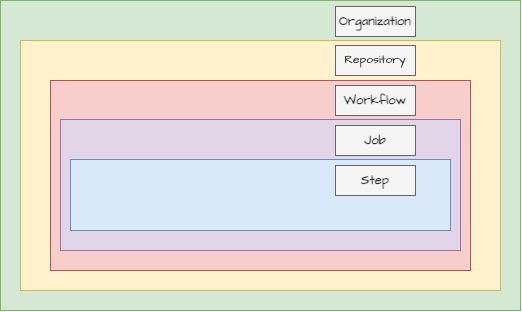

# Tryout Github Actions

Tryout's based on course [GitHub Actions: The Complete Guide from Beginner to Expert](https://www.udemy.com/course/mastering-github-actions-beginner-to-expert/). I have tried to document whatever I have learnt during this journey.

<!-- TOC -->
* [Tryout Github Actions](#tryout-github-actions)
  * [Building blocks](#building-blocks)
  * [Triggers](#triggers)
    * [As list](#as-list)
    * [As map](#as-map)
    * [As map with multiple events](#as-map-with-multiple-events)
    * [As map with branches and paths](#as-map-with-branches-and-paths)
    * [As map with tags](#as-map-with-tags)
    * [As map with condition](#as-map-with-condition)
    * [As map with types](#as-map-with-types)
  * [Runners](#runners)
  * [Activity types](#activity-types)
  * [Context](#context)
  * [Functions](#functions)
<!-- TOC -->

## Building blocks

The basic building blocks of a GitHub Action are:



- **Workflow**: A workflow is an automated process that you define in your repository. It consists of one or more jobs that run in response to specific events, such as a push to the repository or a pull request. Workflows are defined in YAML files and are stored in the `.github/workflows` directory of your repository.
- **Job**: A job is a set of steps that run in the same environment. Each job runs in a fresh instance of the virtual machine, and jobs can run in parallel or sequentially, depending on how you define them in your workflow.
- **Step**: A step is a single task that is part of a job. Steps can run commands, use actions, or run scripts. Each step runs in the same environment as the job, and you can pass data between steps using environment variables.
- **Action**: An action is a reusable unit of code that can be used in a workflow. Actions can be created by you or by the community, and they can be shared and reused across different workflows. Actions can be written in JavaScript or Docker, and they can perform a wide range of tasks, such as building, testing, and deploying code.

Syntax

```yaml
name: [The job name that will be displayed on the Github UI]
on: [The event that triggers the workflow]
jobs:
  [job_id]: # [The job id that will be displayed on the Github UI]  
    name: [The job name that will be displayed on the Github UI]
    runs-on: [The runner that the job will run on]
    steps:
      - name: [The step name that will be displayed on the Github UI]
        uses: [The action that will be used]
        with:
          [key]: [value] # [The input that will be passed to the action]
        run: [The shell command that will be executed]
```

> [Read more about Workflow syntax for GitHub Actions](https://docs.github.com/en/actions/writing-workflows/workflow-syntax-for-github-actions)

## Triggers

You would be able to trigger the workflow mainly by the following ways:



- [Repository events](https://docs.github.com/en/actions/writing-workflows/choosing-when-your-workflow-runs/events-that-trigger-workflows)
- Manual triggers 
  - Through the Github UI (`workflow_dispatch`)
  - [Through the Github API](https://docs.github.com/en/rest/actions/workflows)
  - [Another workflow](https://docs.github.com/en/actions/writing-workflows/choosing-when-your-workflow-runs/triggering-a-workflow#triggering-a-workflow-from-a-workflow)
- Schedule
  - Cron syntax

There are several ways to declare the event that triggers the workflow.

### As list
```yaml
on: [push, pull_request, workflow_dispatch]
```

### As map
```yaml
on:
  push:
  pull_request:
  workflow_dispatch:
```

### As map with multiple events
```yaml
on:
  push: # event 1
    types: # activity types
      - created
      - edited
      - reopened
      - synchronize
    branches:
      - main # event filter
      - master # event filter
  pull_request: # event 2
    branches:
      - main # event filter
      - master # event filter
  workflow_dispatch: # event 3
  schedule: # event 4
    - cron: '0 0 * * *'
```

### As map with branches and paths
```yaml
on:
  push:
    branches:
      - main
      - master
    branches-ignore:
      - dev
    paths:
      - '!docs1/**' #not on docs1
      - 'test/**'
    paths-ignore:
      - 'docs/README.md' # similar to '!docs/README.md' in paths
      - 'test/README.md'
```

### As map with tags
```yaml
on:
  push:
    tags:
      - v1
      - v1.*
    tags-ignore:
      - v1.1
      - v1.2
```

### As map with condition
```yaml
on:
  push:
    condition: ${{ github.event_name == 'pull_request' }}
```


### As map with types
```yaml
on:
  push:
    types:
      - created
      - edited
      - reopened
      - synchronize
```

- When chaining GitHub Actions events like push, pull_request, etc., it is an "or" condition. This means that the workflow will be triggered if any of the specified events occur.
- When you use `branches`/`branches-ignore`, `paths`/`paths-ignore`, `tags`/`tags-ignore`, and `types`, it is an "and" condition. This means that the workflow will be triggered if all the specified conditions are met.

## Runners

Runners can be categorized into two main types:
- **GitHub-hosted runners**: These are virtual machines hosted by GitHub. They come with a set of pre-installed software and tools, and you can also install additional software as needed. Each job runs in a fresh instance of the virtual machine, which is created and destroyed for each job. Jobs get a fresh instance of the virtual machine, which is created and destroyed for each job. This means that you can use the same runner for multiple jobs, but each job will run in its own isolated environment. However, for steps within a job, you can use the same environment and share data between steps. This allows you to run multiple steps in the same environment without having to create a new virtual machine for each step.
- **Self-hosted runners**: These are machines that you manage and maintain. You can install the GitHub Actions runner application on your own servers or cloud instances. Self-hosted runners give you more control over the environment, including the software and tools installed, but you are responsible for maintaining and updating them. Jobs need NOT run in a fresh instance of the virtual machine, and you can share data between jobs. This means that you can use the same runner for multiple jobs, and each job will run in the same environment. This is upto you how you configure the self-hosted runners.

> [Read more about GitHub-hosted runners](https://docs.github.com/en/actions/using-github-hosted-runners/using-github-hosted-runners) and [Self-hosted runners](https://docs.github.com/en/actions/hosting-your-own-runners).

## Events & filters



| **Event**                         | **Description**                                    | **Available Filters**                                                                                     |
|-----------------------------------|----------------------------------------------------|-----------------------------------------------------------------------------------------------------------|
| `push`                            | Triggered on code pushes to a branch               | `branches`, `branches-ignore`, `tags`, `tags-ignore`, `paths`, `paths-ignore`                             |
| `pull_request`                    | Triggered on PR activities (e.g., open, sync)      | `branches`, `branches-ignore`, `paths`, `paths-ignore`, `types` (e.g., `opened`, `synchronize`, `closed`) |
| `workflow_dispatch`               | Manual trigger via UI or API                       | `inputs` (custom user-defined input parameters)                                                           |
| `schedule`                        | Triggered by a cron schedule                       | `cron` (e.g., `'0 0 * * *'` for daily at midnight UTC)                                                    |
| `release`                         | Triggered on release actions                       | `types` (e.g., `published`, `created`, `edited`, `prereleased`, `released`)                               |
| `issues`                          | Triggered on issue events                          | `types` (e.g., `opened`, `edited`, `closed`, `reopened`)                                                  |
| `issue_comment`                   | Triggered on comment activity on issues/PRs        | `types` (e.g., `created`, `edited`, `deleted`)                                                            |
| `pull_request_review`             | Triggered on review activity on PRs                | `types` (e.g., `submitted`, `edited`, `dismissed`)                                                        |
| `pull_request_review_comment`     | Triggered on PR review comments                    | `types` (e.g., `created`, `edited`, `deleted`)                                                            |
| `deployment`, `deployment_status` | Triggered on deployments and their status updates  | No direct filters; respond to all occurrences                                                             |
| `create`, `delete`                | Triggered on creation/deletion of branches or tags | No filters, but event payload includes `ref_type` and `ref`                                               |
| `fork`, `watch`, `star`, etc.     | Triggered on repo events                           | No filters                                                                                                |


## Activity types

| **Event**                     | **Available `types` (Activity Types)**                                                                                                                                                                                  |
|-------------------------------|-------------------------------------------------------------------------------------------------------------------------------------------------------------------------------------------------------------------------|
| `pull_request`                | `assigned`, `unassigned`, `labeled`, `unlabeled`, `opened`, `edited`, `closed`, `reopened`, `synchronize`, `converted_to_draft`, `ready_for_review`, `locked`, `unlocked`, `review_requested`, `review_request_removed` |
| `push`                        | *No activity types* — triggers on all push events; use `branches`, `tags`, and `paths` to filter                                                                                                                        |
| `issues`                      | `opened`, `edited`, `deleted`, `transferred`, `pinned`, `unpinned`, `closed`, `reopened`, `assigned`, `unassigned`, `labeled`, `unlabeled`, `locked`, `unlocked`, `milestoned`, `demilestoned`                          |
| `issue_comment`               | `created`, `edited`, `deleted`                                                                                                                                                                                          |
| `release`                     | `published`, `unpublished`, `created`, `edited`, `deleted`, `prereleased`, `released`                                                                                                                                   |
| `pull_request_review`         | `submitted`, `edited`, `dismissed`                                                                                                                                                                                      |
| `pull_request_review_comment` | `created`, `edited`, `deleted`                                                                                                                                                                                          |
| `create` / `delete`           | *No activity types* — triggered for all create/delete events (use `ref_type` or `ref` inside the job)                                                                                                                   |
| `workflow_run`                | `completed`, `requested`, `in_progress`                                                                                                                                                                                 |
| `deployment`                  | *No activity types*                                                                                                                                                                                                     |
| `deployment_status`           | *No activity types*                                                                                                                                                                                                     |
| `fork`, `watch`, `star`       | *No activity types*                                                                                                                                                                                                     |


The official documentation about GitHub Action types can be found on the GitHub Docs website. It provides detailed information on the various events that can trigger workflows, including repository events, manual triggers, and scheduled events.

You can refer to the [GitHub Actions Events that trigger workflows](https://docs.github.com/en/actions/using-workflows/events-that-trigger-workflows) page for comprehensive details.

The activity types when combined with event types the condition becomes an "and" condition. This means that the workflow will be triggered if all the specified conditions are met.

## Context

| **Context**    | **Description**                                                                     | **Example Usage**                                 |
|----------------|-------------------------------------------------------------------------------------|---------------------------------------------------|
| `github`       | Contains information about the event that triggered the workflow and the repository | `github.ref`, `github.repository`, `github.actor` |
| `env`          | Contains environment variables defined in the workflow or job                       | `env.MY_VAR`                                      |
| `secrets`      | Accesses encrypted secrets stored in the repository or organization                 | `secrets.MY_SECRET`                               |
| `job`          | Information about the current job (status, ID)                                      | `job.status`                                      |
| `steps`        | Contains outputs from previous steps                                                | `steps.my_step.outputs.output_name`               |
| `runner`       | Information about the runner executing the job                                      | `runner.os`, `runner.arch`                        |
| `strategy`     | Used in matrix builds to access the current matrix values                           | `strategy.matrix.node`                            |
| `matrix`       | Shortcut to access the `strategy.matrix` values                                     | `matrix.node`                                     |
| `needs`        | Accesses outputs and results from jobs this job depends on                          | `needs.job_id.outputs.output_name`                |
| `inputs`       | Accesses user-provided inputs to `workflow_dispatch` or reusable workflows          | `inputs.environment`                              |
| `vars`         | Accesses repository-level custom variables                                          | `vars.MY_VAR`                                     |
| `parameters`   | Used in reusable workflows to access inputs passed in                               | `inputs.input_name` (alias for `parameters`)      |
| `github.event` | Contains the full webhook payload that triggered the workflow                       | `github.event.head_commit.message`                |


We use the following syntax to access the context in the workflow:

```yaml
${{ github.context }}
```

The `github` context is an object that contains a variety of information about the event that triggered the workflow. You can use this context to access information about the repository, the workflow, the event, and the actor that triggered the event.

The `event` context is an object that contains the payload of the event that triggered the workflow. You can use this context to access information about the event, such as the type of event, the action that triggered the event, and the payload data.

The `inputs` context is an object that contains the input parameters passed to the action. You can use this context to access the input parameters and use them in your workflow.

The `secrets` context is an object that contains the secrets stored in the repository. You can use this context to access the secrets and use them in your workflow.

- [More about contexts](https://docs.github.com/en/enterprise-cloud@latest/actions/writing-workflows/choosing-what-your-workflow-does/accessing-contextual-information-about-workflow-runs)
- [Context availability](https://docs.github.com/en/enterprise-cloud@latest/actions/writing-workflows/choosing-what-your-workflow-does/accessing-contextual-information-about-workflow-runs#context-availability)

If you wish to debug you could use `toJSON` function to print the context:

```yaml
- name: Print context
  run: echo '${{ toJson(github) }}'
```

## Functions

https://docs.github.com/en/actions/writing-workflows/choosing-what-your-workflow-does/evaluate-expressions-in-workflows-and-actions#functions

| Function name | Description                                                                                                                                      |
|:--------------|:-------------------------------------------------------------------------------------------------------------------------------------------------|
| `success()`   | Returns true if all the previous step have succeeded                                                                                             |
| `always()`    | Causes the step to always run, regardless of the status of previous steps                                                                        |
| `cancelled()` | Returns true if the workflow was cancelled                                                                                                       |
| `failure()`   | Returns true when any previous step of a job fails. If you have a chain of dependent jobs, `failure()` returns `true` if any ancestor job fails. |

## Variables



### `env.<variable>` — Workflow/Job/Step Environment Variables

| Aspect           | Details                                                         |
|------------------|-----------------------------------------------------------------|
| **Scope**        | Defined in workflow, job, or step                               |
| **Set in**       | The `env:` block or inline in a shell step                      |
| **Mutable?**     | ✅ Yes — you can override or change them                         |
| **Usage**        | For temporary config values, secrets masking, or CLI parameters |
| **Accessed via** | `${{ env.MY_VAR }}` in workflow, `$MY_VAR` in shell             |

### `vars.<variable>` — Organization/Repository Environment Variables

| Aspect           | Details                                                            |
|------------------|--------------------------------------------------------------------|
| **Scope**        | Defined at the repository, organization, or environment level (UI) |
| **Set in**       | GitHub UI: *Settings → Variables*                                  |
| **Mutable?**     | ❌ No — set in UI only, not within workflows                        |
| **Usage**        | For shared, reusable configuration values                          |
| **Accessed via** | `${{ vars.MY_VAR }}`                                               |
